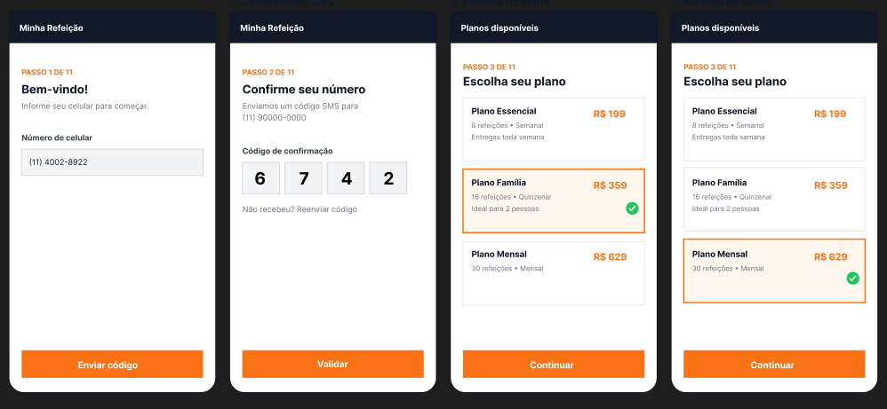
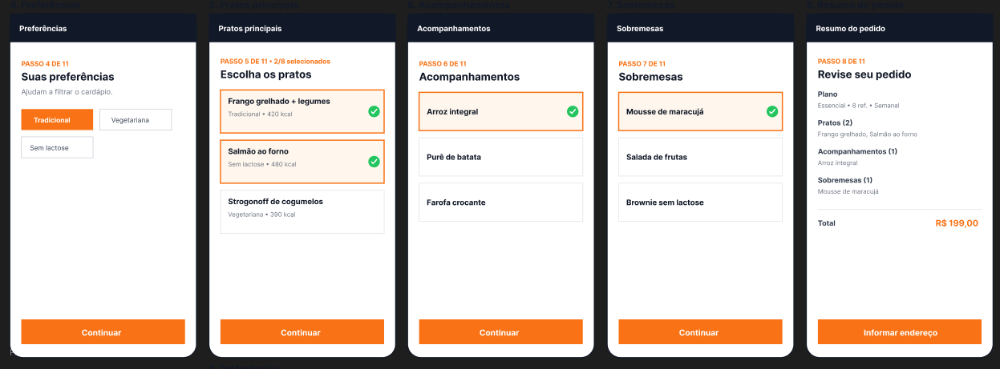
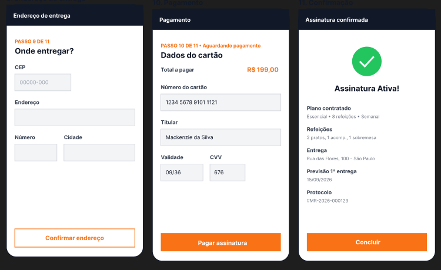
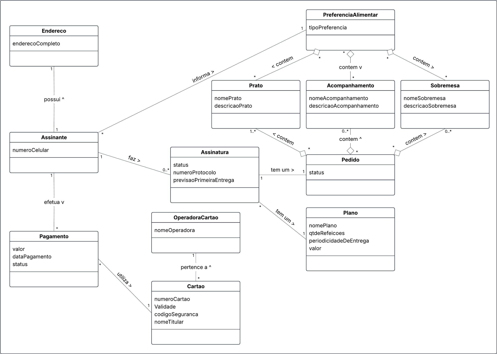

# Serviço de Assinatura de Marmitas (4N)

Este documento apresenta a estruturação das entregas avaliativas do projeto.

---

## GRUPO:

| Nome | RA |
| --- | --- |
| Adam Marinho Falaschi | 10736005 |
| Carlos Fernando Gomes de Pontes | 10444932 |
| Raphael Oliveira Silva Batista | 10732698 |

---

## N1 - Entrega 1:

O bloco N1 - Entrega 1 é composto pelo protótipo com a sequência de telas do projeto e o vídeo explicativo:

### 1. Protótipo do projeto
* **Link do protótipo no Figma:** [Protótipo](https://www.figma.com/design/yqduOJjYlgCcJaGfc2iHdD/Sem-t%C3%ADtulo?node-id=1-274&t=mOEBDBmTkbCYHwkR-1)

### 2. Sequência de telas (caminho feliz)
* Onboarding: etapa em que o usuário inicia o processo de assinatura, informa o número de celular, recebe o código de confirmação via SMS e escolhe seu plano.

 

* Escolha de preferências e montagem do pedido: etapa em que o usuário escolhe suas preferências de cardápio, escolhe os pratos, acompanhamentos, sobremesas e revisa seu pedido.

 

* Cadastro de endereço e pagamento: etapa em que o usuário cadastra seu endereço, faz o pagamento do pedido com o cartão e revisa sua assinatura.

 

### 3. Vídeo de apresentação
* **Vídeo da N1 - Entrega 1:** [Assistir ao Vídeo Explicativo](https://youtu.be/fnZCeVywArA)

### 4. Diagrama de classes

---
